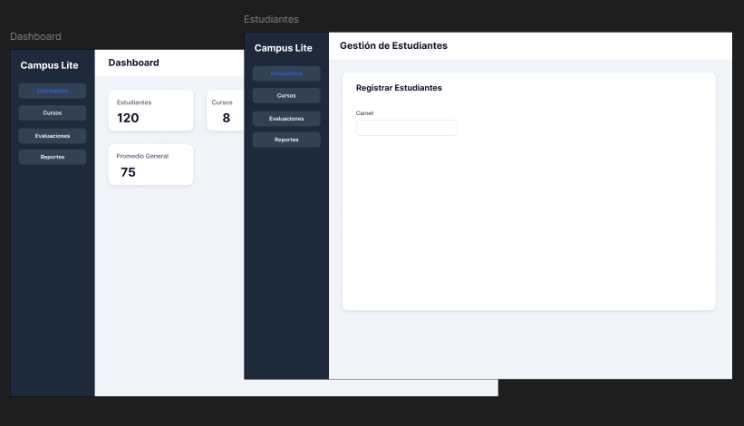
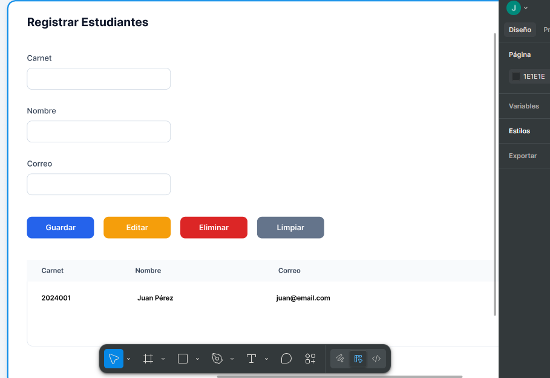

# Campus Lite

Proyecto integrador desarrollado en Java Swing para la gestión académica básica de estudiantes, cursos, inscripciones y evaluaciones.

## Integrantes

- Yesmy Darlery
- Oscar Norbey
- José Daniel

## Opción del proyecto

**Opción A – Campus Lite**

Sistema académico que permite:

- Gestionar estudiantes.
- Gestionar cursos.
- Realizar inscripciones.
- Registrar evaluaciones.
- Calcular resultados académicos.
- Generar reportes.

---

## Tecnologías utilizadas

- Java
- Java Swing
- Eclipse IDE
- CSV para persistencia de datos
- Git y GitHub

---

## Requisitos

- JDK 17 o superior
- Eclipse IDE (o cualquier IDE compatible con Java)

---

## Cómo ejecutar el proyecto

1. Clonar el repositorio:

```bash
git clone https://github.com/yescobare2/Proyecto_Programacion.git
```

2. Abrir el proyecto en Eclipse.

3. Ejecutar la clase:

```text
com.campuslite.main.Main
```

4. La aplicación iniciará mostrando el menú principal.

---

## Estructura del proyecto

```text
com.campuslite

├── domain
│   ├── Course
│   ├── Enrollment
│   ├── Evaluation
│   ├── GradeRecord
│   ├── Laboratory
│   ├── Person
│   ├── ProjectEvaluation
│   ├── Student
│   └── WrittenExam
│
├── logic
│   ├── CourseManager
│   ├── EnrollmentManager
│   ├── EvaluationManager
│   ├── ReportManager
│   ├── StudentManager
│   └── ValidationUtils
│
├── persistence
│   ├── CourseCSVRepository
│   ├── EnrollmentCSVRepository
│   ├── EvaluationCSVRepository
│   ├── StudentCSVRepository
│   └── FilePaths
│
├── ui
│   ├── MainFrame
│   ├── StudentsPanel
│   ├── CoursesPanel
│   ├── EnrollmentsPanel
│   ├── EvaluationsPanel
│   ├── ReportsPanel
│   ├── ModernButton
│   ├── ModernTable
│   ├── UIStyles
│   └── logo.png
│
└── main
    └── Main
```

---

## Persistencia de datos

La aplicación almacena la información utilizando archivos CSV ubicados en la carpeta:

```text
data/
```

Archivos utilizados:

```text
students.csv
courses.csv
enrollments.csv
evaluations.csv
```

Los datos permanecen almacenados después de cerrar y volver a abrir la aplicación.

---

## Programación Orientada a Objetos

### Encapsulamiento

Todos los atributos se encuentran privados y son accesibles mediante getters y setters con validaciones.

Ejemplo:

- Person
- Student
- Course
- Evaluation

---

### Herencia

La clase abstracta:

```java
Person
```

es heredada por:

```java
Student
```

La clase abstracta:

```java
Evaluation
```

es heredada por:

```java
WrittenExam
Laboratory
ProjectEvaluation
```

---

### Abstracción

Se utilizan dos clases abstractas:

#### Person

```java
public abstract String getFullInfo();
```

#### Evaluation

```java
public abstract String getTypeName();

public abstract double calculateContribution();
```

---

### Polimorfismo

Las evaluaciones son manejadas mediante referencias del tipo:

```java
Evaluation
```

permitiendo trabajar con:

```java
WrittenExam
Laboratory
ProjectEvaluation
```

sin conocer el tipo concreto.

Ejemplo:

```java
List<Evaluation> evaluations;
```

---

### Sobrescritura (@Override)

Las subclases de Evaluation implementan:

```java
@Override
public double calculateContribution()
```

y

```java
@Override
public String getTypeName()
```

según el comportamiento específico de cada tipo de evaluación.

---

### Sobrecarga

Se implementa mediante constructores con distintas firmas en diversas clases del dominio.

Ejemplo:

```java
public Person()

public Person(String id,
              String firstName,
              String lastName,
              String email)
```

---

## Funcionalidades implementadas

### Estudiantes

- Agregar estudiantes.
- Editar estudiantes.
- Eliminar estudiantes.
- Limpiar estudiantes.
- Validación de campos obligatorios.
- Validación de nombres sin números.

### Cursos

- Agregar cursos.
- Editar cursos.
- Eliminar cursos.
- Limpiar cursos
- Validación de cupo y créditos.

### Inscripciones

- Inscribir estudiantes.
- Desinscribir estudiantes.
- Eliminación automática de inscripciones relacionadas.

### Evaluaciones

- Exámenes escritos.
- Laboratorios.
- Proyectos.
- Registro de notas.
- Validación de porcentajes.

### Reportes

- Consulta de estudiantes.
- Consulta de cursos.
- Visualización de resultados académicos.

---

## Capturas de pantalla

### Menú principal



### Gestión de estudiantes



---

## Herramientas de planificación

- Trello
- GitHub

---

## Estado del proyecto

Versión académica funcional desarrollada para el curso de Programación I utilizando Java Swing y Programación Orientada a Objetos.